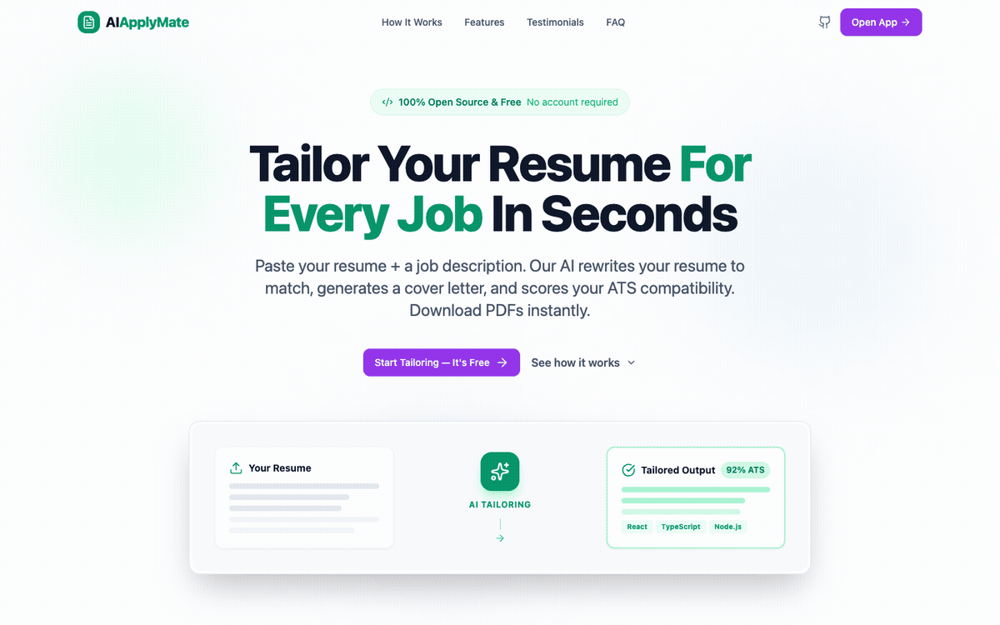
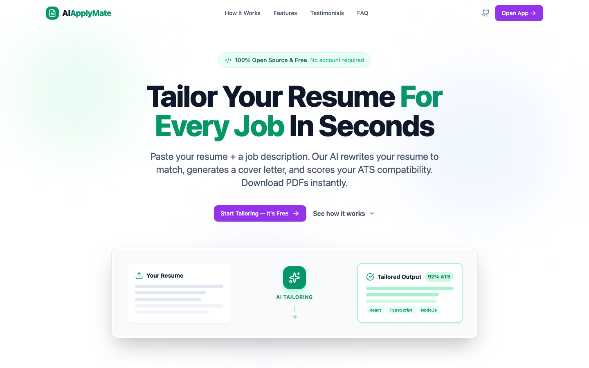
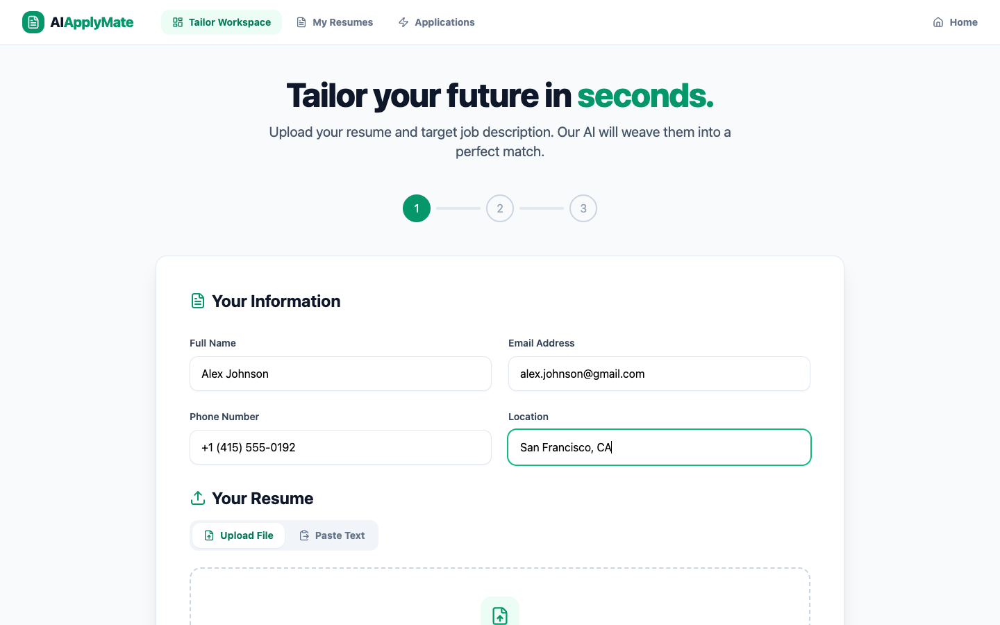
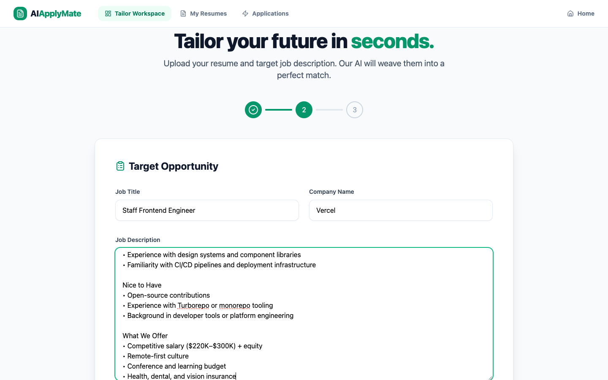

# AIApplyMate — Free, Open-Source AI Resume Tailoring

<p align="center">
  <strong>Tailor your resume for every job in seconds. No account required.</strong>
</p>

<p align="center">
  <a href="https://github.com/Aneek1/aiapplymate/blob/main/LICENSE"></a>
  
</p>

---

AIApplyMate is a free, open-source tool that uses **Google Gemini AI** to tailor your resume and generate cover letters for specific job descriptions. Upload or paste your resume, paste the job posting, and get an ATS-optimized resume + cover letter as downloadable PDFs — in under 30 seconds.

## Demo

<p align="center">
  
</p>

### Landing Page

<p align="center">
  
</p>

### Step 1 — Enter Your Info & Resume

<p align="center">
  
</p>

### Step 2 — Paste the Job Description

<p align="center">
  
</p>

## Features

- **AI Resume Tailoring** — Rewrites your resume to match any job description
- **Cover Letter Generation** — Creates a personalized cover letter for each application
- **ATS Scoring** — Scores your resume's ATS compatibility and shows injected keywords
- **File Upload** — Upload PDF, DOCX, or TXT resumes (parsed client-side)
- **PDF Downloads** — Export tailored resumes and cover letters as professional PDFs
- **Resume Library** — All tailored documents are saved and accessible from the history page
- **No Authentication** — Fully anonymous, no account needed
- **Self-Hostable** — Run the entire stack locally or deploy anywhere

## Tech Stack

| Layer | Technologies |
|-------|-------------|
| **Frontend** | React 19, TypeScript, Vite, TailwindCSS, shadcn/ui, Lucide React |
| **Backend** | Node.js, Express, MongoDB, Mongoose |
| **AI** | Google Gemini AI (`@google/generative-ai`) |
| **PDF Generation** | Puppeteer (headless Chrome) |
| **File Parsing** | pdfjs-dist (PDF), mammoth (DOCX) — client-side |

## Project Structure

```
aiapplymate/
├── app/                        # Frontend (React + Vite)
│   ├── src/
│   │   ├── pages/              # Landing, Dashboard, Applications
│   │   ├── sections/           # ResumeManager + reusable sections
│   │   ├── hooks/              # useTailoring, useResumeLibrary, useFileParser
│   │   ├── services/           # API client (api.ts)
│   │   ├── components/         # Layout, UI components (shadcn)
│   │   └── contexts/           # ThemeContext
│   └── package.json
├── autoapply-backend/          # Backend (Express + MongoDB)
│   ├── src/
│   │   ├── routes/             # API route handlers
│   │   ├── services/           # Gemini AI service, PDF service
│   │   ├── models/             # Mongoose models
│   │   ├── middleware/          # Auth middleware
│   │   └── utils/              # Response helpers
│   └── package.json
└── README.md
```

## Quick Start

### Prerequisites

- **Node.js** 18+
- **MongoDB** (local or [Atlas](https://www.mongodb.com/cloud/atlas))
- **Google Gemini API Key** — [Get one free](https://aistudio.google.com/app/apikey)
- **Google Chrome** (required for PDF generation via Puppeteer)

### 1. Clone the repo

```bash
git clone https://github.com/Aneek1/aiapplymate.git
cd aiapplymate
```

### 2. Backend setup

```bash
cd autoapply-backend
npm install
cp .env.example .env
```

Edit `.env` with your values:

```env
PORT=5000
MONGODB_URI=mongodb://localhost:27017/aiapplymate
JWT_SECRET=any-random-string
GEMINI_API_KEY=your_gemini_api_key_here
FRONTEND_URL=http://localhost:5173
```

Start the backend:

```bash
npm run dev
```

### 3. Frontend setup

```bash
cd app
npm install
npm run dev
```

Open **http://localhost:5173** in your browser.

## Environment Variables

### Backend (`autoapply-backend/.env`)

| Variable | Description | Default |
|----------|-------------|---------|
| `PORT` | Server port | `5000` |
| `MONGODB_URI` | MongoDB connection string | `mongodb://localhost:27017/aiapplymate` |
| `JWT_SECRET` | JWT signing secret | *required* |
| `GEMINI_API_KEY` | Google Gemini API key | *required* |
| `FRONTEND_URL` | Frontend URL for CORS | `http://localhost:5173` |

### Frontend (`app/.env`)

| Variable | Description | Default |
|----------|-------------|---------|
| `VITE_API_URL` | Backend API base URL | `http://localhost:5000/api` |

## How It Works

1. **Paste or upload** your existing resume (PDF, DOCX, or TXT — parsed entirely in the browser)
2. **Enter the target job** — title, company, and full job description
3. **AI tailors your resume** — Gemini rewrites it to match the job, generates a cover letter, and calculates an ATS score
4. **Download PDFs** — professionally formatted resume and cover letter, ready to submit
5. **Save to library** — all tailored documents are stored in MongoDB for later access

## Contributing

PRs welcome! To contribute:

1. Fork the repo
2. Create your feature branch (`git checkout -b feature/my-feature`)
3. Commit your changes (`git commit -m 'Add my feature'`)
4. Push to the branch (`git push origin feature/my-feature`)
5. Open a Pull Request

### Ideas for contributions

- LinkedIn job description auto-import
- Multiple PDF templates/themes
- Multi-language resume support
- Bulk tailoring for multiple jobs
- Browser extension for one-click tailoring from job boards

## License

MIT — free to use, modify, and distribute. See [LICENSE](LICENSE) for details.
